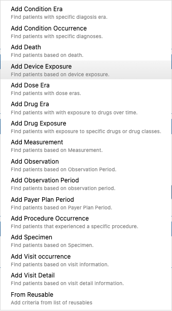
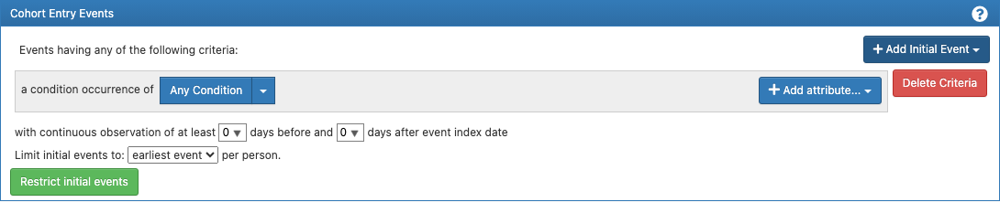
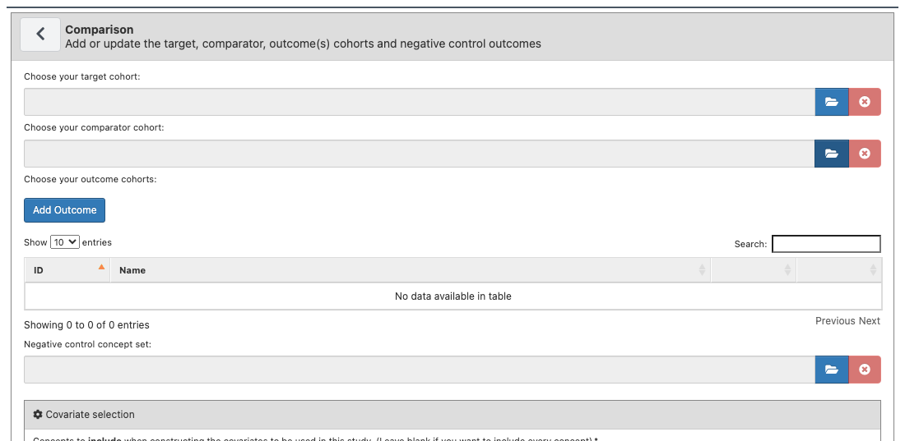
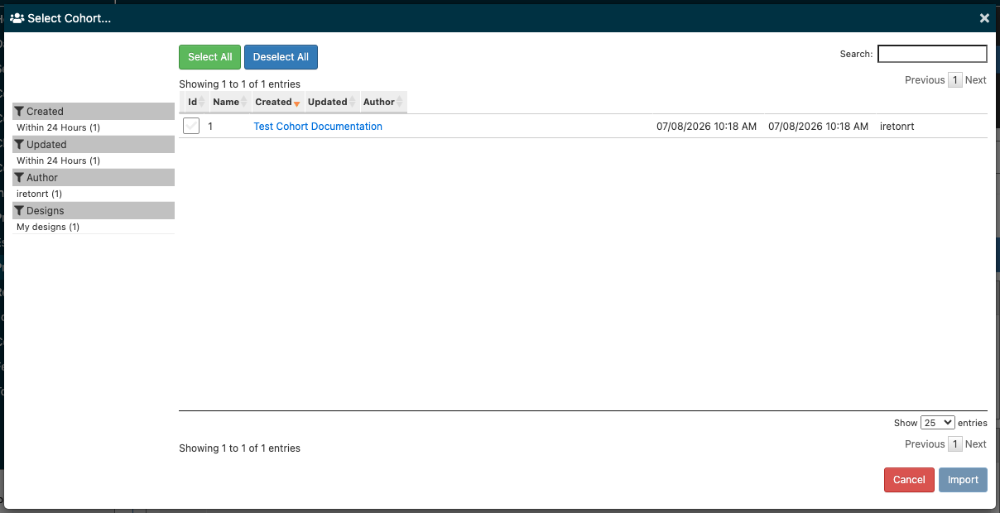

# Common Atlas Tasks

Step-by-step notes for recurring workflows in this Atlas instance.

## Creating a Concept Set

1. **Search for concepts** — go to Search (left nav), enter a term, check the box next to each concept you want to include.
2. **Set modifiers before adding** — toggle Exclude / Descendants / Mapped in the add-box if you want them applied to the concepts you're about to add (these apply to whatever's currently checked, not retroactively).
3. **Add them to a set** — click "Add To New Concept Set" (or, if you already have one in progress, the button will say "Add To Concept Set" and target that same set). "Preview…" just shows you what *would* be added — clicking Apply in that modal does the actual add, same as the button.
4. **Repeat** — search again, select more concepts, add again. Each add appends to the same in-progress set.
5. **Save it** — click **Concept Sets** in the left nav (cart icon). Since you have an unsaved set in progress, it routes you straight to that set's editor instead of the browse list. Name it there and click Save.

Note: Atlas does not dedupe concept IDs within a set — see [FUTURE_CONSIDERATIONS.md](FUTURE_CONSIDERATIONS.md).

## Creating a Cohort Definition

1. **Start a new one** — click **Cohort Definitions** (left nav), then **New Cohort**.
2. **Name it** — the name field defaults to "New Cohort Definition" and Atlas won't let you save until you change it (a red warning appears under the field otherwise).
3. **Add entry criteria** — under Cohort Entry Events, click **+ Add Initial Event** and pick a criteria type (Condition Occurrence, Drug Exposure, Procedure Occurrence, Visit, Measurement, etc. — 15+ types, plus "From Reusable" to pull in a saved reusable criteria set):

   

   Each criteria type gets its own editor row (e.g. "a condition occurrence of **Any Condition**") where you can narrow the concept set and add attributes via **+ Add attribute…**:

   
4. **Add inclusion criteria / cohort exit rules** (optional) — the Inclusion Criteria and Cohort Exit panels below Entry Events follow the same "+ Add…" pattern.
5. **Save** — click the floppy-disk icon next to the name field. Atlas assigns it a numeric ID ("Cohort #N") and unlocks the rest of the tabs: **Concept Sets** (auto-populated from any concept sets referenced in your criteria), **Generation** (run it against a data source), **Samples**, **Reporting**, **Export**, **Versions**, **Messages**.

Note: this cohort definition is the reusable building block for Estimation, Prediction, and Characterizations below — each of those pulls in existing cohort definitions by ID rather than letting you define criteria inline.

## Running a Population Level Effect Estimation (Estimation)

1. **Start a new one** — click **Estimation** (left nav), then **New Population Level Effect Estimation**. This opens the "Comparative Cohort Analysis" editor with **Specification** / **Utilities** / **Messages** tabs.
2. **Name it** — same rule as cohort definitions: the default name must be changed before you can save.
3. **Add a comparison** — under Comparisons, click **+ Add Comparisons**. This opens a sub-editor where you choose your **target cohort** and **comparator cohort** (both pulled from your saved Cohort Definitions via a folder-icon picker), one or more **outcome cohorts** (**+ Add Outcome**), and optionally a negative control concept set. Covariate selection (concepts to include/exclude when building covariates) is further down the same panel.

   
4. **Add analysis settings** — under Analysis Settings, click **+ Add Analysis Settings** to configure time-at-risk windows, adjustment strategy, and outcome model per analysis.
5. **Save**, then use the **Generation** area (per-source, once available) to actually run the analysis against a data source.

## Running a Patient Level Prediction (Prediction)

1. **Start a new one** — click **Prediction** (left nav), then **New Patient Level Prediction**.
2. **Name it** — same rule as above.
3. **Pick your target and outcome cohorts** — under Prediction Problem Settings, use **+ Add Target Cohort** and **+ Add Outcome Cohort**. Each opens a "Select Cohort…" modal listing your saved Cohort Definitions with checkboxes (**Select All** / **Deselect All**) and an **Import** button to confirm the selection. Characterizations' "Choose a Cohort definition" import (below) uses this same picker.

   
4. **Configure the rest** — the **VIEW** sub-tabs (All / Prediction Problem Settings / Analysis Settings / Execution Settings / Training Settings) let you jump straight to a section instead of scrolling the full page.
5. **Save**, then use **Utilities** / **Executions** to run it against a data source.

## Building a Cohort Characterization

1. **Start a new one** — click **Characterizations** (left nav) → **Characterizations** tab → **New Characterization**.
2. **Name it** — same rule as above.
3. **Import a cohort definition** — under "Cohort definition", click **Import**. This opens a "Choose a Cohort definition" modal (same Select All/Deselect All/checkbox pattern as Prediction's cohort picker) — pick one or more saved Cohort Definitions to characterize.
4. **Import feature analyses** — under "Feature analyses", click **Import** to pull in predefined or reusable feature analyses (what gets summarized: conditions, drugs, measurements, etc., with "Supports annual" / "Supports temporal" flags shown per analysis).
5. **Save**, then use the **Executions** tab to run the characterization against a data source, or **Concept Sets** to review concept sets referenced by the imported feature analyses.
